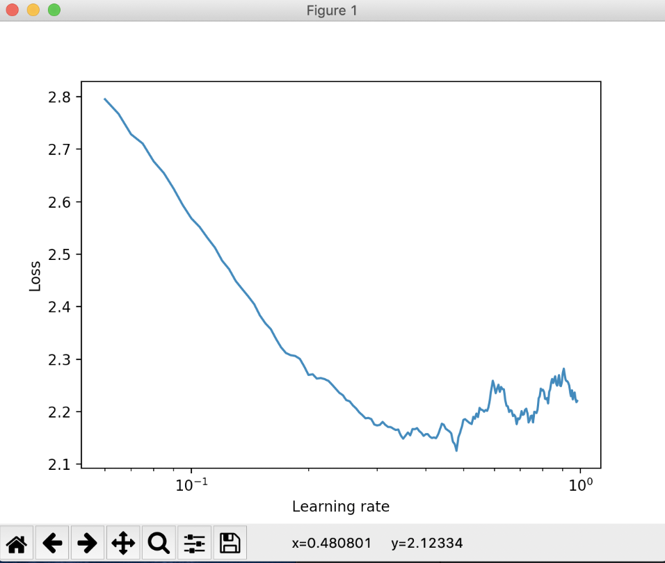

<h1 align="center"><b><i>Gesture recognizer</i></b></h1>

    
      
    
    

<h2> :file_folder: Dataset</h2>

<b>Hand Gesture of the Colombian sign language</b>

Dataset was taken from kaggle (link [here](https://www.kaggle.com/evernext10/hand-gesture-of-the-colombian-sign-language#0_men%20(10).JPG)) and contains images of hand gestures for numbers (0-5) and vowels (A, E, I, O, U). Based on [EDA](https://github.com/joanna-janos/GestureRecognizer/blob/master/data_analysis/EDA.ipynb) I chose a subset of gestures to recognize (1, 2, 3, 4, 5, A, O, U).

:exclamation: Example images can be found on the bottom of [EDA](https://github.com/joanna-janos/GestureRecognizer/blob/master/data_analysis/EDA.ipynb).

<h2> :hammer: Input preprocessing</h2>

Images were resized to 512x256. During training they were vertically flipped, have randomly added noise and increased brightness and contrast.

<h2> :gear: Model</h2>

More information about used models and why I chose them can be found [here](https://github.com/joanna-janos/GestureRecognizer/blob/master/model/MODEL_SELECTION.md)

<h2> :earth_americas: Conda environment </h2>

Create conda environment from yml file:  
`conda env create -f environment/environment.yml`  
then activate using command:  
`conda activate gesture_recognizer`

<h2> :eyes: Tasks</h2>

You can run app for 3 tasks:
1. `find_mean_std` - find mean and std values which should be used to normalize data; run: `python main.py find_mean_std`
2. `find_lr` - find optimal learning rate for model (should be used before training to set it up correctly); run: `python main.py find_lr`
3. `train` - conduct training of model; run: `python main.py train`

:question: If you need any help regarding additional arguments available to provide by user run `python main.py --help`

<h2> :boom: Results</h2>

1. <b>Overall results for `find_lr` and `train` tasks</b>

<h4> WITHOUT NORMALIZATION </h4>

LR FINDER

| Model name    | Pretrained    | Iterations    | Min lr set in finder | Max lr set in finder | Found lr |
| ------------- | ------------- | ------------- | -------------------- | ---------------------| ---------|
| MnasNet       | Yes           | 200           | 1e-7                 | 1                    | 4e-1     |
| MnasNet       | No            | 200           | 1e-7                 | 1                    | 2.5e-1   |
| SqueezeNet    | Yes           | 200           | 1e-7                 | 1                    | 3.3e-1   |
| MobileNetV2   | Yes           | 200           | 1e-7                 | 1                    | 5e-1     |

TRAINING

| Model name    | Pretrained    | Epochs trained| Max validation accuracy | Min lr set in cyclic lr scheduler   | Max lr set in cyclic lr scheduler |
| ------------- | ------------- | ------------- | ----------------------- | ----------------------------------- | ----------------------------------|
| MnasNet       | Yes           | 50            | 61.89%                  | 4e-4                                | 4e-2                              |
| MnasNet       | No            | 30            | 13.73%                  | 2.5e-4                              | 2.5e-2                            |
| SqueezeNet    | Yes           | 100           | 70.08%                  | 3.5e-4                              | 3.5e-3                            |
| MobileNetV2   | Yes           | 80            | 65.36%                  | 5e-4                                | 5e-3                              |

MnasNet: As a max learning rate for cyclic lr scheduler I set lr found by lr finder divided by 10, as a min lr - found lr divided by 1000.
In SqueezeNet I didn't take 3.3e-1 (found lr) but 3.5e-1 because it gives me better results. As a min I have divided it by 1000, as a max - by 100. Same for MobileNetV2 was applied.

<h4> WITH NORMALIZATION </h4>

1. Hand gesture recognizer  

Mean and std was obtained using `find_mean_std` task based on <b>Hand Gesture of the Colombian sign language dataset</b>.  
Mean: [0.7315, 0.6840, 0.6410]  
Std: [0.4252, 0.4546, 0.4789]

LR FINDER

| Model name    | Pretrained    | Iterations    | Min lr set in finder | Max lr set in finder | Found lr |
| ------------- | ------------- | ------------- | -------------------- | ---------------------| ---------|
| MnasNet       | Yes           | 200           | 1e-7                 | 1                    | 3.7e-1   |
| SqueezeNet    | Yes           | 200           | 1e-7                 | 1                    | 5e-1     |
| MobileNetV2   | Yes           | 200           | 1e-7                 | 1                    | 3.5e-1   |

TRAINING

| Model name    | Pretrained    | Epochs trained| Max validation accuracy | Min lr set in cyclic lr scheduler   | Max lr set in cyclic lr scheduler |
| ------------- | ------------- | ------------- | ----------------------- | ----------------------------------- | ----------------------------------|
| MnasNet       | Yes           | 100           | 80.74%                  | 3.3e-3                              | 3.5e-2                            |
| SqueezeNet    | Yes           | 100           | 79.09%                  | 5e-3                                | 5e-2                              |
| MobileNetV2   | Yes           | 100           | 70.29%                  | 3.5e-4                              | 3.5e-3                            |

2. <b>Lr finder</b>

Plots obtained using LRFinder are located under `results/NORMALIZATION/visualisations_lr_finder/MODEL_NAME/` directory.
You can find plots for pretrained and not pretrained models under specific directories. There are 2 files: plot obtained using lr finder with information about lr value and loss in the lowest point and zoomed area of interest.

Example (pretrained MnasNet; without normalization):

3. <b>Models</b>

Trained models are saved in `results/NORMALIZATION/model/MODEL_NAME/` directory. Only models better than previous will be saved.  
Under directory containing model name you can find 2 directories: one contains saved models for pretrained model, second for not pretrained.
Validation accuracy is set as a filename.

:exclamation: Only model with the highest score is uploaded to github.

4. <b>Size</b>

I have to take into account the size of the model, because it should be small for mobile phones.

| Model name    | Pretrained    | Size (MB) |
| ------------- | ------------- | --------- |
| MnasNet       | Yes           | 13.9      | 
| MnasNet       | No            | 13.9      | 
| SqueezeNet    | Yes           | 3         | 
| MobileNetV2   | Yes           | 10.4      |

5. <b>Tensorboard</b>

Run `tensorboard --logdir=results/NORMALIZATION/tensorboard` and open `http://localhost:6006` in your browser to check train/validation accuracy/loss during all epochs

